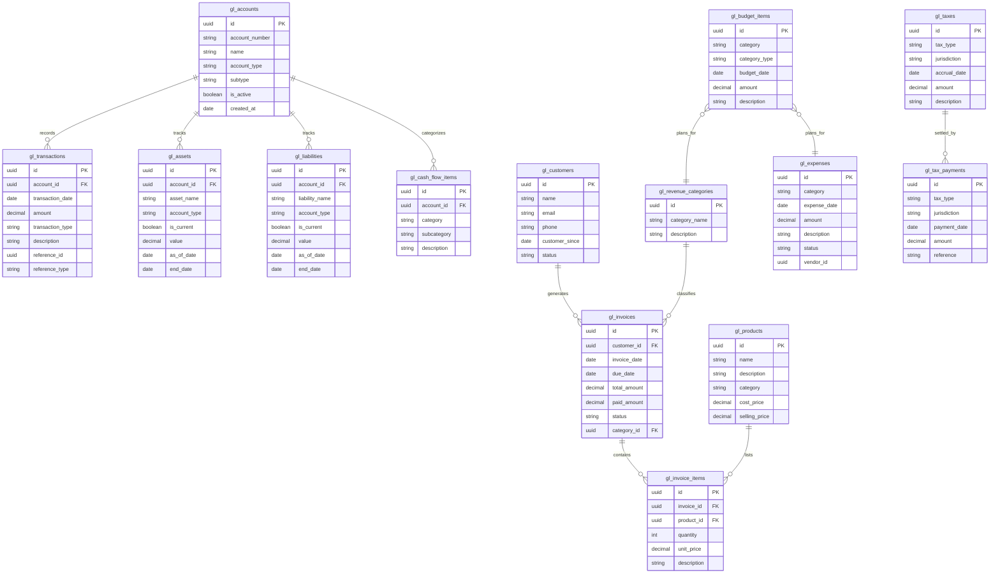

# Database Schema for Financial Analysis

This document provides an overview of the database schema required for the financial analysis SQL queries. Understanding these tables and their relationships is essential for effectively using and customizing the queries.

## Core Tables and Relationships

## Key Table Descriptions

### Core Financial Tables

1. **gl_accounts**
   - Central record of all accounts in the general ledger
   - Links to transactions, assets, and liabilities
   - Contains account classification information

2. **gl_transactions**
   - Records all financial transactions
   - Links to specific accounts
   - Contains amount, date, and transaction type (debit/credit)
   - References source documents via reference_id and reference_type

### Asset and Liability Tracking

3. **gl_assets**
   - Tracks all company assets
   - Contains valuation information
   - Records whether assets are current or non-current
   - Tracks asset lifecycle with as_of_date and end_date

4. **gl_liabilities**
   - Tracks all company liabilities
   - Contains obligation amounts
   - Records whether liabilities are current or long-term
   - Tracks liability lifecycle with as_of_date and end_date

### Sales and Customers

5. **gl_customers**
   - Central customer information
   - Tracks customer relationships with customer_since date
   - Contains contact information

6. **gl_invoices**
   - Tracks all customer invoices
   - Links to customers and revenue categories
   - Contains invoice totals, payments, and status

7. **gl_invoice_items**
   - Line items within invoices
   - Links to products
   - Contains quantity and pricing information

8. **gl_products**
   - Product catalog
   - Contains cost and pricing information
   - Includes categorization

### Expenses and Budgeting

9. **gl_expenses**
   - Records all business expenses
   - Categorizes expenses
   - Contains payment status
   - Links to vendors

10. **gl_budget_items**
    - Budget planning information
    - Categorizes budget items by type (revenue or expense)
    - Contains projected amounts for specific dates

### Tax Management

11. **gl_taxes**
    - Tracks tax accruals
    - Records tax types and jurisdictions
    - Contains accrual dates and amounts

12. **gl_tax_payments**
    - Records payments made against tax liabilities
    - Links to tax types and jurisdictions
    - Contains payment dates and references

### Classification Tables

13. **gl_revenue_categories**
    - Categorizes revenue sources
    - Used for reporting and analysis

14. **gl_cash_flow_items**
    - Classifies accounts for cash flow reporting
    - Categorizes into operating, investing, or financing activities

## Important Relationships for Financial Analysis

1. **Balance Sheet Analysis**
   - Uses gl_assets and gl_liabilities tables for the as_of_date
   - May calculate equity from gl_accounts depending on implementation

2. **Income Statement Analysis**
   - Uses gl_invoices and gl_invoice_items for revenue
   - Uses gl_expenses for expense data
   - Relies on date ranges for period specification

3. **Cash Flow Analysis**
   - Uses gl_transactions for actual cash movements
   - Uses gl_cash_flow_items for categorization
   - Relies on date ranges for period specification

4. **Budget Variance Analysis**
   - Compares gl_budget_items to actual revenue (gl_invoices) and expenses (gl_expenses)
   - Groups by categories for meaningful comparison

## Data Requirements and Preparation

To effectively use the financial analysis queries, ensure:

1. **Complete date coverage**
   - Financial transactions should have no gaps in the analyzed periods
   - Asset and liability valuations should be available at required dates

2. **Consistent categorization**
   - Expenses and revenue should use consistent categories
   - Cash flow classifications should be complete for all relevant accounts

3. **Proper account structure**
   - Account types should be correctly assigned
   - Current/non-current designations should be accurate

4. **Data integrity**
   - Invoice totals should match sum of invoice items
   - Paid amounts should reflect actual payments received

## Query Adaptation Guidelines

When adapting queries to your specific implementation:

1. **Check column names**
   - Verify all column references match your actual schema
   - Adjust any discrepancies in table or column naming

2. **Validate relationships**
   - Ensure JOINs use the correct keys for your schema
   - Adjust any differences in relationship structure

3. **Review calculations**
   - Verify calculation methods match your accounting practices
   - Adjust formulas for any business-specific requirements

4. **Test with sample data**
   - Validate results with known financial totals
   - Verify calculations match expected outcomes 