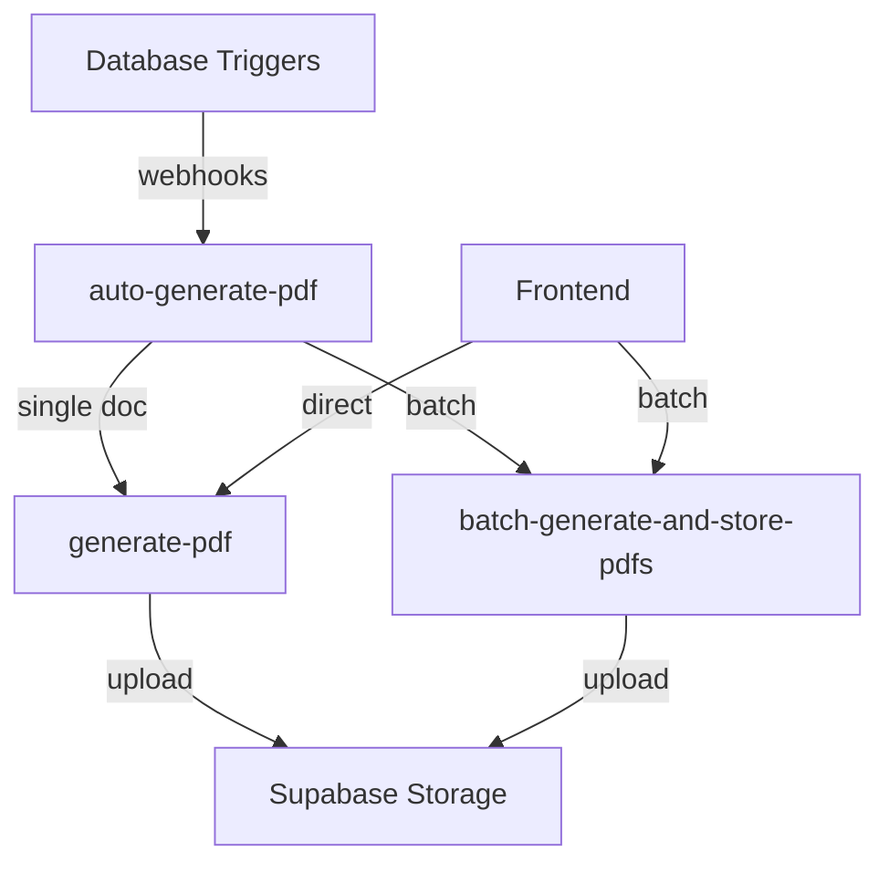

# PDF Generation System Documentation

## Overview

The PDF generation system has been refactored to work with the current database schema, specifically utilizing `rowid_` and `glide_row_id` fields instead of foreign keys. The system follows a modular approach with separate modules for different document types (invoices, estimates, purchase orders, and products) and leverages Supabase edge functions for server-side PDF generation and storage. 

The system now features **fully automated PDF generation** with database triggers that automatically initiate PDF generation when documents are created or updated. It includes a sophisticated error handling system with exponential backoff retry mechanisms, comprehensive logging, and a monitoring dashboard for tracking PDF generation metrics and managing failures.

## Automated PDF Generation System

### Database Triggers

The system uses PostgreSQL triggers to automatically initiate PDF generation when documents are created or updated:

```sql
-- Trigger function that calls the PDF backend when documents are updated
CREATE OR REPLACE FUNCTION trigger_pdf_generation()
RETURNS TRIGGER AS $$
DECLARE
  v_document_type TEXT;
  v_payload JSONB;
BEGIN
  -- Determine document type based on table
  CASE TG_TABLE_NAME
    WHEN 'gl_invoices' THEN v_document_type := 'invoice';
    WHEN 'gl_estimates' THEN v_document_type := 'estimate';
    WHEN 'gl_purchase_orders' THEN v_document_type := 'purchase_order';
  END CASE;
  
  -- Create payload and call PDF backend
  v_payload := jsonb_build_object(
    'action', 'trigger',
    'documentType', v_document_type,
    'documentId', NEW.id
  );
  
  -- Call webhook asynchronously
  PERFORM http_post(...);
  
  RETURN NEW;
END;
$$ LANGUAGE plpgsql;
```

### Error Handling and Retry Mechanism

The system implements a sophisticated error handling approach with exponential backoff for retries:

1. **Failure Tracking**: All PDF generation failures are logged in the `pdf_generation_failures` table
2. **Exponential Backoff**: Retry intervals increase with each attempt (5min → 15min → 30min → 1hr → ...)
3. **Manual Intervention**: After 10 failed attempts, the system flags the failure for manual resolution
4. **Admin Interface**: Dedicated UI for reviewing and resolving failures

```sql
-- Function for logging failures with exponential backoff
CREATE OR REPLACE FUNCTION log_pdf_generation_failure(
  p_document_type TEXT,
  p_document_id TEXT,
  p_error_message TEXT
) RETURNS VOID AS $$
BEGIN
  -- Implementation with exponential backoff calculation
  v_backoff_minutes := LEAST(5 * POWER(2, v_retry_count - 1), 1440);
  -- Update retry count and next attempt time
END;
$$ LANGUAGE plpgsql;
```

### Scheduled Jobs

The system uses pg_cron to schedule important maintenance tasks:

1. **Periodic Scanning**: Checks for documents with null PDF URLs every 30 minutes
2. **Retry Processing**: Attempts to retry failed generations every 10 minutes
3. **Log Cleanup**: Removes old logs and resolved failures to maintain database performance

### Monitoring Dashboard

A comprehensive monitoring dashboard provides insights into PDF generation metrics:

1. **Document Coverage**: Percentage of documents with generated PDFs
2. **Success Rates**: Success/failure statistics for recent PDF generations
3. **Document Type Breakdown**: Metrics segmented by document type (invoices, estimates, purchase orders)
4. **Filtering Options**: Time range and document type filtering for focused analysis

## Architecture

### System Components

1. **Frontend Client Libraries**
   - Document-specific modules for client-side PDF generation
   - Batch PDF generation utilities
   - PDF operations hook for React components
   - `PDFActions` component for standardized PDF operations

2. **Edge Functions**
   - `pdf-backend`: Unified edge function with multiple endpoints for all PDF operations
     - `/generate`: Creates and stores PDFs for individual documents
     - `/batch`: Processes multiple PDF generations in bulk
     - `/scan`: Scans database for documents with null PDF URLs
     - `/trigger`: Handles database trigger webhooks
     - `/retry`: Processes retry of failed PDF generations
   - `scheduled-pdf-generation`: Handles scheduled scanning and automatic PDF generation

   **Note:** As of April 2025, the following legacy edge functions have been completely removed:
   - `store-pdf`
   - `generate-pdf`
   - `batch-generate-and-store-pdfs`
   - `auto-generate-pdf`
   
   All PDF operations now use the standardized `pdf-backend` function with explicit project ID (swrfsullhirscyxqneay).

3. **Database Components**
   - Database triggers on table inserts/updates for automatic PDF generation
   - Scheduled functions via pg_cron for periodic scanning and retry processing
   - PDF generation tracking tables with comprehensive logging
   - Failure tracking with exponential backoff retry scheduling
   - Row-level security policies for secure access control

4. **Storage**
   - PDFs are stored in Supabase Storage buckets
   - URLs are updated in the original database records

### Document-Specific Modules

The PDF generation system is organized into document-specific modules:

- `src/lib/pdf/common.ts`: Shared utilities and types for PDF generation
- `src/lib/pdf/invoice-pdf.ts`: Invoice-specific PDF generation logic
- `src/lib/pdf/estimate-pdf.ts`: Estimate-specific PDF generation logic
- `src/lib/pdf/purchase-order-pdf.ts`: Purchase order-specific PDF generation logic
- `src/lib/pdf/product-pdf.ts`: Product-specific PDF generation logic

### Automation and Error Handling Components

- `supabase/functions/pdf-backend/retry-handler.ts`: Handles retry logic for failed PDF generations
- `src/hooks/usePDFFailures.ts`: React hook for managing PDF generation failures
- `src/hooks/usePDFMonitoring.ts`: Hook for monitoring PDF generation statistics
- `src/components/new/pdf/pdf-failures-manager.tsx`: UI component for managing PDF failures
- `src/pages/admin/pdf-management.tsx`: Admin page for PDF system management

### PDF Generation Flow

#### Client-Side Flow
1. UI component calls `usePDFOperations` hook
2. Hook delegates to appropriate document-specific module
3. Module uses detail hook to fetch data with proper relationships
4. Module generates PDF using jsPDF
5. PDF is converted to a blob and a blob URL is created
6. URL is returned to UI for display/download/sharing

#### Server-Side Flow (Edge Functions)
1. Edge function receives document type and ID
2. Fetches document data with all related information using Glidebase pattern
3. Generates PDF using PDF-lib
4. Uploads PDF to Supabase Storage
5. Updates the document record with the PDF URL
6. Returns the public URL to the client

## Core Components

### 1. Frontend Libraries

#### Common Types and Utilities

```typescript
// src/lib/pdf/common.ts

/**
 * Enum for different types of PDF generation errors
 * @enum {string}
 */
export enum PDFErrorType {
  FETCH_ERROR = 'FETCH_ERROR',
  GENERATION_ERROR = 'GENERATION_ERROR',
  STORAGE_ERROR = 'STORAGE_ERROR'
}

/**
 * Interface for PDF error structure
 * @interface PDFError
 * @property {PDFErrorType} type - The type of error that occurred
 * @property {string} message - Human-readable error message
 */
export interface PDFError {
  type: PDFErrorType;
  message: string;
}

/**
 * Interface for PDF operation result containing success status, URL, and potential error
 * @interface PDFOperationResult
 * @property {boolean} success - Whether the operation was successful
 * @property {string} [url] - URL to the generated PDF if successful
 * @property {PDFError} [error] - Error details if operation failed
 */
export interface PDFOperationResult {
  success: boolean;
  url?: string;
  error?: PDFError;
}

/**
 * Creates a standardized success result for PDF operations
 * @param {string} url - The URL to the generated PDF
 * @returns {PDFOperationResult} Success result object
 */
export function createPDFSuccess(url: string): PDFOperationResult {
  return { success: true, url };
}

/**
 * Creates a standardized error result for PDF operations
 * @param {PDFErrorType} type - The type of error that occurred
 * @param {string} message - Human-readable error message
 * @returns {PDFOperationResult} Error result object
 */
export function createPDFError(type: PDFErrorType, message: string): PDFOperationResult {
  return { success: false, error: { type, message } };
}
```

#### Document-Specific Modules

Each document type has its own module with three main functions:

1. **Data Fetching**: Retrieves document data with all related information
2. **PDF Generation**: Creates a PDF document using jsPDF
3. **Direct Download**: Handles PDF generation and download

Example for invoices:

```typescript
// src/lib/pdf/invoice-pdf.ts

/**
 * Fetches an invoice with all related data needed for PDF generation
 * @param {string} invoiceId - The UUID of the invoice to fetch
 * @returns {Promise<InvoiceWithDetails | null>} Full invoice data object or null if not found
 */
export async function fetchInvoiceForPDF(invoiceId: string): Promise<InvoiceWithDetails | null> {
  // Fetches invoice data with related information using Glidebase pattern
  // (uses rowid_ fields instead of foreign keys)
}

/**
 * Generates a PDF document for an invoice
 * @param {InvoiceWithDetails} invoice - The invoice data with all details
 * @returns {jsPDF} PDF document object
 */
export function generateInvoicePDF(invoice: InvoiceWithDetails): jsPDF {
  // Creates a PDF document using jsPDF
}

/**
 * Generates an invoice PDF and optionally triggers download
 * @param {string} invoiceId - The UUID of the invoice
 * @param {boolean} [download=false] - Whether to download the PDF
 * @returns {Promise<PDFOperationResult>} Result of the operation
 */
export async function generateAndStoreInvoicePDF(
  invoiceId: string,
  download: boolean = false
): Promise<PDFOperationResult> {
  // Handles the complete workflow including direct download
}
```

#### Batch PDF Generator

```typescript
// src/lib/batch-pdf-generator.ts

/**
 * Defines the possible states of a batch PDF generation job
 * @type {string}
 */
export type BatchJobStatus = 'pending' | 'processing' | 'completed' | 'failed';

/**
 * Interface for batch PDF generation job data
 * @interface BatchPDFJob
 * @property {string} id - Unique identifier for the job
 * @property {'invoice' | 'purchaseOrder' | 'estimate'} documentType - Type of documents to process
 * @property {string[]} documentIds - Array of document IDs to generate PDFs for
 * @property {BatchJobStatus} status - Current status of the job
 * @property {number} progress - Number of documents processed
 * @property {number} total - Total number of documents to process
 * @property {string} [startedAt] - ISO timestamp when job started
 * @property {string} [completedAt] - ISO timestamp when job completed
 * @property {string} [error] - Error message if job failed
 * @property {Object[]} [results] - Array of results for each document
 */
export interface BatchPDFJob {
  id: string;
  documentType: 'invoice' | 'purchaseOrder' | 'estimate';
  documentIds: string[];
  status: BatchJobStatus;
  progress: number;
  total: number;
  startedAt?: string;
  completedAt?: string;
  error?: string;
  results?: {
    documentId: string;
    pdfUrl: string | null;
    success: boolean;
    error?: string;
  }[];
}

/**
 * Creates a new batch PDF generation job
 * @param {'invoice' | 'purchaseOrder' | 'estimate'} documentType - Type of documents to process
 * @param {string[]} documentIds - Array of document IDs to generate PDFs for
 * @returns {Promise<BatchPDFJob | null>} The created job or null if creation failed
 */
export async function createBatchPDFJob(
  documentType: 'invoice' | 'purchaseOrder' | 'estimate',
  documentIds: string[]
): Promise<BatchPDFJob | null> {
  // Implementation details
}

/**
 * Starts processing a batch PDF generation job
 * @param {string} jobId - The ID of the job to process
 * @returns {Promise<boolean>} Whether the job was started successfully
 */
export async function startBatchPDFJob(jobId: string): Promise<boolean> {
  // Implementation details
}

/**
 * Gets the current status of a batch PDF generation job
 * @param {string} jobId - The ID of the job to check
 * @returns {Promise<BatchPDFJob | null>} Current job status or null if not found
 */
export async function getBatchPDFJobStatus(jobId: string): Promise<BatchPDFJob | null> {
  // Implementation details
}
```

#### PDF Operations Hook

```typescript
// src/hooks/pdf/usePDFOperations.ts

/**
 * Hook that provides unified interface for all PDF operations
 * @returns {Object} PDF operations functions and state
 */
export const usePDFOperations = () => {
  // State for tracking operations
  const [isGenerating, setIsGenerating] = useState(false);
  const [isStoring, setIsStoring] = useState(false);

  /**
   * Generates a PDF for a specific document type and ID
   * @param {DocumentType} documentType - Type of document (invoice, estimate, etc)
   * @param {string} documentId - UUID of the document
   * @param {boolean} [downloadAfterGeneration=false] - Whether to download after generation
   * @returns {Promise<string | null>} URL to the generated PDF or null if generation failed
   */
  const generatePDF = async (
    documentType: DocumentType,
    documentId: string,
    downloadAfterGeneration: boolean = false
  ): Promise<string | null> => {
    // Delegates to the appropriate document-specific module
  };

  /**
   * Downloads a PDF from URL with specified filename
   * @param {string} url - URL to the PDF
   * @param {string} fileName - Name to use for the downloaded file
   * @returns {Promise<void>}
   */
  const downloadPDF = async (url: string, fileName: string): Promise<void> => {
    // Downloads the PDF using file-saver
  };

  return { generatePDF, downloadPDF, isGenerating, isStoring };
};
```

### 2. Edge Functions

The system has three complementary edge functions for PDF generation:

1. **generate-pdf**: Generates a PDF for a single document
2. **auto-generate-pdf**: Triggers PDF generation based on database events
3. **batch-generate-and-store-pdfs**: Processes multiple PDF requests efficiently

#### Edge Function Architecture



#### Generate PDF Edge Function

```typescript
// supabase/functions/generate-pdf/index.ts

/**
 * Edge function that generates PDFs on the server
 * 
 * @function serve
 * @description HTTP handler for PDF generation requests
 * 
 * @param {Request} req - The HTTP request object
 * @returns {Response} HTTP response with generated PDF URL or error
 * 
 * Request format:
 * {
 *   "type": "invoice" | "estimate" | "purchaseorder",
 *   "id": "uuid-of-document"
 * }
 * 
 * Response format:
 * {
 *   "success": true,
 *   "url": "https://...pdf-url..." 
 * }
 * 
 * Or error:
 * {
 *   "success": false,
 *   "error": "Error message"
 * }
 */
serve(async (req: Request) => {
  // Implementation details
});

/**
 * Generates a PDF for an invoice using pdf-lib
 * @function generateInvoicePDF
 * @param {any} invoice - Invoice data with related information
 * @returns {Promise<Uint8Array | null>} PDF as byte array or null if generation failed
 */
async function generateInvoicePDF(invoice: any): Promise<Uint8Array | null> {
  // Implementation details
}

/**
 * Generates a PDF for an estimate using pdf-lib
 * @function generateEstimatePDF
 * @param {any} estimate - Estimate data with related information
 * @returns {Promise<Uint8Array | null>} PDF as byte array or null if generation failed
 */
async function generateEstimatePDF(estimate: any): Promise<Uint8Array | null> {
  // Implementation details
}

/**
 * Generates a PDF for a purchase order using pdf-lib
 * @function generatePurchaseOrderPDF
 * @param {any} purchaseOrder - Purchase order data with related information
 * @returns {Promise<Uint8Array | null>} PDF as byte array or null if generation failed
 */
async function generatePurchaseOrderPDF(purchaseOrder: any): Promise<Uint8Array | null> {
  // Implementation details
}
```

#### Auto Generate PDF Edge Function

```typescript
// supabase/functions/auto-generate-pdf/index.ts

/**
 * Edge function that automatically generates PDFs when documents are created or updated
 * @function serve
 * @description Processes database webhook events to trigger PDF generation
 * 
 * @param {Request} req - The HTTP request with webhook payload
 * @returns {Response} HTTP response with status of PDF generation
 * 
 * Webhook payload format for single document:
 * {
 *   "type": "INSERT" | "UPDATE",
 *   "table": "gl_invoices" | "gl_estimates" | "gl_purchase_orders",
 *   "record": { ...document data },
 *   "schema": "public",
 *   "old_record": { ...previous data } // only for UPDATE events
 * }
 * 
 * Batch processing payload:
 * {
 *   "batch": true,
 *   "documentType": "invoice" | "estimate" | "purchaseorder",
 *   "ids": ["id1", "id2", "id3", ...]
 * }
 */
serve(async (req: Request) => {
  // Implementation details
});

/**
 * Handles batch PDF generation request
 * @function handleBatchRequest
 * @param {any} supabaseAdmin - Supabase admin client
 * @param {any} payload - Batch request payload
 * @returns {Promise<Response>} HTTP response
 */
async function handleBatchRequest(supabaseAdmin: any, payload: any): Promise<Response> {
  // Implementation details
}

/**
 * Handles single document PDF generation
 * @function handleSingleDocument
 * @param {any} supabaseAdmin - Supabase admin client
 * @param {any} payload - Webhook payload
 * @returns {Promise<Response>} HTTP response
 */
async function handleSingleDocument(supabaseAdmin: any, payload: any): Promise<Response> {
  // Implementation details
}
```

#### Batch Generate and Store PDFs Edge Function

```typescript
// supabase/functions/batch-generate-and-store-pdfs/index.ts

/**
 * Document types supported for PDF generation
 * @enum {string}
 */
enum DocumentType {
  INVOICE = 'invoice',
  ESTIMATE = 'estimate',
  PURCHASE_ORDER = 'purchaseorder',
}

/**
 * Configuration schema for document types
 * @interface DocumentTypeConfig
 * @property {string} tableName - Table name for the main document
 * @property {string} [linesTableName] - Table name for line items if any
 * @property {string} uidField - Field to use for the document identifier
 * @property {string} accountRefField - Field referencing the account
 * @property {string} storageFolder - Storage folder path
 * @property {Object[]} [additionalRelations] - Additional relations to fetch
 */
interface DocumentTypeConfig {
  tableName: string;
  linesTableName?: string;
  uidField: string;
  accountRefField: string;
  storageFolder: string;
  additionalRelations?: {
    tableName: string;
    referenceField: string;
  }[];
}

/**
 * Edge function that batch generates PDFs for multiple documents
 * @function serve
 * @description Handles batch processing of PDF generation requests
 * 
 * @param {Request} req - HTTP request with batch items
 * @returns {Response} HTTP response with results for each document
 *
 * Request format:
 * {
 *   "items": [
 *     { "id": "uuid1", "type": "invoice" },
 *     { "id": "uuid2", "type": "estimate" },
 *     ...
 *   ]
 * }
 *
 * Response format:
 * {
 *   "results": [
 *     { "id": "uuid1", "type": "invoice", "success": true, "url": "https://..." },
 *     { "id": "uuid2", "type": "estimate", "success": false, "error": "Error message" },
 *     ...
 *   ]
 * }
 */
serve(async (req: Request) => {
  // Implementation details
});

/**
 * Generates a PDF document based on document type and data
 * @function generatePDF
 * @param {string} type - The document type
 * @param {any} data - The document data including related records
 * @returns {Promise<Uint8Array | null>} PDF as byte array or null if generation failed
 */
async function generatePDF(type: string, data: any): Promise<Uint8Array | null> {
  // Implementation details
}

/**
 * Generates a filename in the format: Prefix + Account UID + Date in MMDDYY format
 * @function generateFileName
 * @param {DocumentType} documentType - The document type
 * @param {any} documentData - The document data
 * @returns {string} The generated filename
 */
function generateFileName(documentType: DocumentType, documentData: any): string {
  // Implementation details
}
```

## UI Components

### PDF Generation Button

```typescript
// src/components/pdf/PDFGenerationButton.tsx

/**
 * Button component for generating PDFs with various options
 * @param {Object} props - Component properties
 * @param {DocumentType} props.documentType - Type of document (invoice, estimate, etc)
 * @param {string} props.documentId - UUID of the document
 * @param {boolean} [props.download=false] - Whether to download the generated PDF
 * @param {boolean} [props.showPreview=true] - Whether to show preview after generation
 * @param {Function} [props.onSuccess] - Callback for successful generation
 * @param {Function} [props.onError] - Callback for generation errors
 * @param {boolean} [props.showLabel=true] - Whether to show button label
 * @param {string} [props.className=''] - Additional CSS classes
 */
export function PDFGenerationButton({
  documentType,
  documentId,
  download = false,
  showPreview = true,
  onSuccess,
  onError,
  showLabel = true,
  className = '',
  ...props
}: PDFGenerationButtonProps) {
  // Uses the usePDFOperations hook to generate and handle PDFs
}
```

### Batch PDF Generator UI

```typescript
// src/components/pdf/batch-pdf-generator.tsx

/**
 * Component for generating PDFs in batch
 * @param {Object} props - Component properties
 * @param {DocumentType} props.documentType - Type of documents to process
 * @param {string[]} props.selectedIds - Array of document IDs to generate PDFs for
 * @param {Function} [props.onComplete] - Callback when batch job completes
 */
export function BatchPDFGenerator({
  documentType,
  selectedIds,
  onComplete
}: BatchPDFGeneratorProps) {
  // Implementation details
}
```

## Usage Examples

### Basic PDF Generation

```tsx
// Generate and download an invoice PDF
<PDFGenerationButton 
  documentType="invoice" 
  documentId="123" 
  download={true} 
/>

// Generate and preview a product PDF
<PDFGenerationButton 
  documentType="product" 
  documentId="456" 
  showPreview={true} 
/>
```

### Batch PDF Generation

```tsx
// Generate PDFs for multiple invoices
<BatchPDFGenerator
  documentType="invoice"
  selectedIds={['123', '456', '789']}
  onComplete={(results) => console.log('Completed with results:', results)}
/>
```

### Server-Side Generation via Edge Function

```typescript
// Call the generate-pdf edge function directly
const generatePDFViaEdgeFunction = async (type: string, id: string) => {
  const { data, error } = await supabase.functions.invoke('generate-pdf', {
    body: { type, id }
  });
  
  if (error) {
    console.error('Error generating PDF:', error);
    return null;
  }
  
  return data?.url;
};
```

### Auto-Triggering PDF Generation

The PDF generation system has multiple automatic triggering mechanisms:

1. **Database Triggers**: When documents are inserted or updated in relevant tables (gl_invoices, gl_estimates, gl_purchase_orders), database triggers automatically call the PDF backend function via webhook.

2. **Scheduled Scanning**: A scheduled function runs at regular intervals to identify and process documents with null `supabase_pdf_url` fields.

3. **Manual Regeneration**: Users can force regeneration of PDFs from the UI even if a PDF URL already exists.

When a document is processed, the system generates the PDF, stores it in Supabase storage, and updates the `supabase_pdf_url` field with the public URL.

## Automated Retry System and Error Handling

The PDF generation system includes a sophisticated error handling and retry mechanism:

### Error Categorization and Handling

1. **Error Types**: Uses the `PDFErrorType` enum to categorize errors (validation, database, authentication, generation, storage)
2. **Structured Responses**: Edge functions return standardized error responses with appropriate HTTP status codes
3. **Comprehensive Logging**: All errors are logged with request IDs for traceability

### Automated Retry Mechanism

1. **Failure Tracking**: Failed PDF generations are recorded in the `pdf_generation_failures` table with detailed error information
2. **Exponential Backoff**: Retries use an exponential backoff strategy:
   - Initial retry after 5 minutes
   - Subsequent retries at increasing intervals (15, 30, 60, 120, 240, 480, 960 minutes)
   - Maximum interval capped at 24 hours

3. **Scheduled Processing**: A cron job runs every 10 minutes to check for and retry failed generations
4. **Manual Intervention**: After 10 failed attempts, items are flagged for manual intervention
5. **Automatic Resolution**: When a PDF is successfully generated, its failure record is marked as resolved

### Failure Management

1. **Monitoring**: The system maintains statistics on success/failure rates of PDF generation
2. **Cleanup**: Resolved failure records are automatically purged after 30 days
3. **Manual Reset**: Administrators can manually reset failure counters for specific documents

### Fallback Strategies

1. **Cache Utilization**: If a new generation fails but a previous PDF exists, the system can retain the existing PDF
2. **On-Demand Generation**: The UI provides fallback options for manual generation when automated processes fail

## Performance Optimization

1. **Caching**: Generated PDFs are cached to avoid regeneration of unchanged documents
2. **Batch Processing**: Multiple PDFs can be generated in parallel using the batch functions
3. **Edge Function Execution**: PDF generation is offloaded to edge functions to avoid impacting client performance
  
  return <Button onClick={handleGeneratePDF}>Generate PDF</Button>;
}
```

## Error Handling

The PDF generation system uses a standardized error handling approach:

1. Each module returns a `PDFOperationResult` with success status and error details
2. Errors are categorized by type (fetch, generation, storage)
3. Detailed error messages are provided for troubleshooting
4. Console logs are used for debugging

## Troubleshooting

### Common Issues and Solutions

1. **PDF generation fails with "Error fetching document"**
   - Check if the document ID exists in the database
   - Verify that the document ID is passed correctly (string, not object)
   - Ensure the database connection is working

2. **PDF preview doesn't show**
   - Verify that the blob URL is valid
   - Check that the PDF viewer component is properly configured
   - Ensure the blob hasn't been revoked

3. **PDF download fails**
   - Check that the file-saver library is properly imported
   - Verify that the blob is valid
   - Look for errors in the console related to the download process

4. **"[object Object]" errors in document IDs**
   - Make sure to pass string IDs to PDF generation functions
   - If passing objects, ensure they have id or glide_row_id properties
   - Check the console for detailed error messages

## Recent Improvements

1. **Enhanced error handling**:
   - All PDF modules now use `maybeSingle()` instead of `single()` when fetching records
   - This prevents the "JSON object requested, multiple (or no) rows returned" errors

2. **Improved document ID handling**:
   - All PDF generation functions now accept either string IDs or object references
   - Logic to extract the correct ID from objects has been added

3. **Direct download mechanism**:
   - PDF modules now create blob URLs directly instead of using Supabase storage
   - This eliminates dependency on external storage and simplifies the download process
   - Uses file-saver library for reliable downloads across browsers

4. **Column existence checking**:
   - Added schema validation before querying columns that might not exist
   - Prevents errors when database schema differs from expected

## Future Enhancements

1. **Supabase Storage Integration**:
   - In the future, we plan to reimplement Supabase storage for PDFs
   - This will allow for persistent storage and sharing of PDFs
   - The current direct download approach will be maintained as a fallback

2. **PDF Caching**:
   - Implement a caching mechanism to avoid regenerating unchanged PDFs
   - Store blob URLs in memory for quick access

3. **Batch PDF Generation**:
   - Add support for generating multiple PDFs at once
   - Create ZIP archives for downloading multiple PDFs

## Best Practices

1. Always pass string IDs to PDF generation functions when possible
2. Use the document-specific PDF actions components for the best user experience
3. Handle errors gracefully in the UI with informative messages
4. Use the `usePDFOperations` hook for all PDF operations to ensure consistent behavior
5. Remember to revoke blob URLs when they are no longer needed to prevent memory leaks
