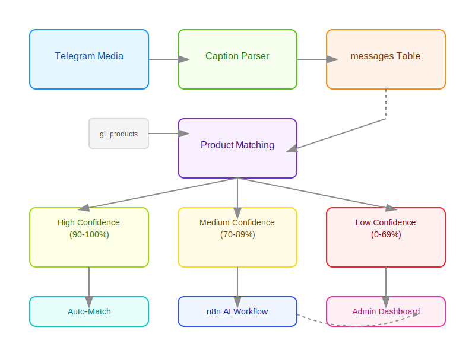

# Telegram Product Matching System

## Overview

The Telegram Product Matching System is a comprehensive solution that automatically matches incoming Telegram media messages with products in the `gl_products` table. It facilitates quick product creation for unrecognized media and establishes a product approval queue for efficient management and review of new products.

## Key Features

- **Automatic Media Matching**: Uses a sophisticated scoring algorithm to match media messages to existing products
- **Confidence-Based Routing**: Routes matches to appropriate workflows based on confidence levels:
  - High confidence (90-100%): Auto-matched
  - Medium confidence (70-89%): Sent to n8n AI for evaluation
  - Low confidence (0-69%): Sent to manual approval queue
- **AI Integration**: Leverages n8n workflows with AI for enhanced matching decisions
- **Drag-and-Drop Admin Interface**: Intuitive admin panel for reviewing and approving product matches
- **Batch Operations**: Support for bulk approval and rejection of product matches

## Documentation Structure

- [Database Layer](./database-layer.md): Details on tables, functions, and SQL implementation
- [Frontend Components](./frontend-components.md): UI components and React hooks
- [n8n Integration](./n8n-integration.md): Setup for AI-assisted matching workflow
- [Admin Dashboard](./admin-dashboard.md): Usage guide for the approval interface

## System Architecture

### Data Flow

1. Telegram media is received and stored in the `messages` table
2. The `match_message_to_products` function evaluates potential matches
3. Based on confidence score, message is:
   - Automatically matched to a product
   - Sent to n8n for AI-assisted matching
   - Added to the approval queue for manual review
4. Admin users review and approve/reject matches through the dashboard
5. Approved matches link the media to the correct product in `gl_products`

## Setup Requirements

- Supabase PostgreSQL database
- React 18+ with TypeScript
- @dnd-kit library for drag-and-drop functionality
- n8n instance for AI integration (optional)

## Getting Started

To start using the Telegram Product Matching System:

1. Make sure the database migrations have been applied (see [Database Layer](./database-layer.md))
2. Install required frontend dependencies
3. Add the `ProductMatchingDashboard` component to your routes
4. Configure n8n webhooks if using AI integration

## Related Documentation

- [Supabase-Glide Synchronization](../supabase-glide-sync/README.md)
- [Telegram Media Integration](../telegram-integration/README.md)
