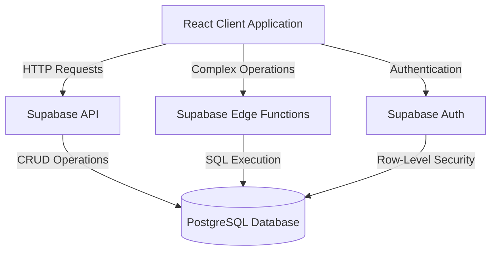
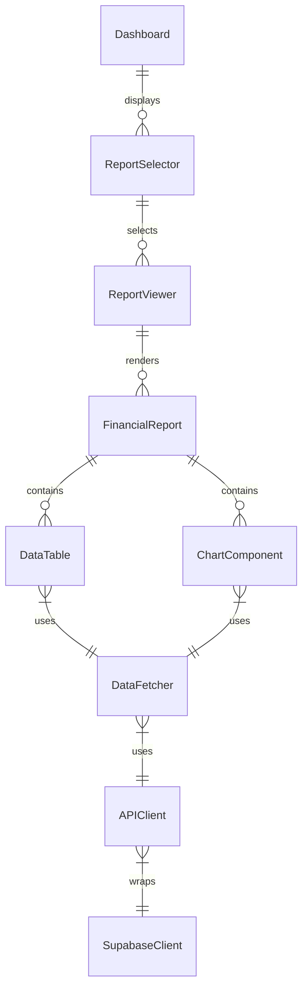

# System Patterns: Financial Analytics System

## System Architecture

The Financial Analytics System follows a modern, serverless architecture built around the Supabase ecosystem, with a clear separation between data processing and presentation layers.

### Core Components

1. **PostgreSQL Database**
   - Central data store with schema optimized for financial analysis
   - Leverages PostgreSQL features like CTEs and window functions
   - Uses table relationships to maintain data integrity

2. **Supabase API Layer**
   - RESTful and real-time API for data access
   - Handles authentication and authorization
   - Implements row-level security for data protection

3. **Edge Functions**
   - Processes complex financial calculations
   - Handles report generation logic
   - Serves as API endpoints for complex operations

4. **React Client Application**
   - Interface for user interaction
   - Renders data visualizations and reports
   - Manages application state and user preferences

## Key Technical Decisions

### Database Approach

1. **Schema Design**
   - Financial tables (gl_accounts, gl_transactions, etc.) structured for accounting standards
   - Normalized schema with clear relationships between entities
   - Strategic denormalization for reporting performance where needed

2. **SQL Query Patterns**
   - Common Table Expressions (CTEs) for readability and reuse
   - Window functions for time-series financial calculations
   - Strategic use of materialized views for performance

3. **Security Model**
   - Row-Level Security (RLS) policies on all tables
   - Service roles for backend operations
   - Least privilege principle for all access

### API Strategy

1. **Data Access Layer**
   - Supabase JavaScript client for standard CRUD operations
   - Custom PostgreSQL functions for complex queries
   - Edge functions for multi-step processing

2. **Real-time Updates**
   - Subscription-based updates for dashboards
   - Optimistic UI updates with confirmation
   - Conflict resolution strategies for concurrent edits

3. **Performance Optimizations**
   - Query parameter optimization
   - Response caching where appropriate
   - Pagination for large result sets

### Frontend Architecture

1. **Component Structure**
   - Atomic design pattern for UI components
   - Feature-based organization for business logic
   - Shared components for consistent UX

2. **State Management**
   - React Context for application state
   - TanStack Query for server state management
   - Local component state for UI-specific concerns

3. **Data Visualization**
   - Tremor for chart components
   - Dynamic rendering based on data characteristics
   - Consistent visual language across reports

## Design Patterns in Use

### Backend Patterns

1. **Repository Pattern**
   - Abstraction layer for database access
   - Consistent interface for data operations
   - Isolation of SQL complexity

2. **Facade Pattern**
   - Simplified interface for complex subsystems
   - Unified API for related financial operations
   - Abstraction of implementation details

3. **Command Query Responsibility Segregation (CQRS)**
   - Separation of read and write operations
   - Optimized queries for reporting functions
   - Specialized write operations for data integrity

### Frontend Patterns

1. **Container/Presentation Pattern**
   - Separation of data fetching and presentation
   - Reusable presentation components
   - Testable business logic

2. **Custom Hooks Pattern**
   - Encapsulation of related functionality
   - Reusable data fetching logic
   - Shared stateful behavior

3. **Render Props / Higher-Order Components**
   - Sharing complex behaviors between components
   - Composition over inheritance
   - Code reuse for cross-cutting concerns

## Component Relationships

### Key Components

1. **Dashboard**
   - Entry point for users
   - Displays summary metrics and navigation
   - Manages global filters and settings

2. **ReportSelector**
   - Enables selection of different report types
   - Manages report parameters and filters
   - Triggers report generation

3. **ReportViewer**
   - Container for individual reports
   - Handles report-specific settings
   - Manages report export and sharing

4. **FinancialReport**
   - Specific report implementation (e.g., Balance Sheet)
   - Contains report-specific logic and calculations
   - Composed of DataTable and ChartComponent

5. **DataFetcher**
   - Abstract data access layer
   - Manages loading, error, and success states
   - Transforms raw data for presentation

6. **APIClient**
   - Wrapper around Supabase client
   - Provides consistent interface for data access
   - Handles authentication and error management

## Evolution and Extension

The system architecture is designed for incremental growth with:

1. **New Report Types**
   - Add new SQL queries following established patterns
   - Create corresponding UI components
   - Minimal changes to existing codebase

2. **Enhanced Analytics**
   - Add new calculation methods to existing queries
   - Extend the data model with new tables as needed
   - Create new visualization components

3. **Integration Points**
   - Well-defined API for external system integration
   - Webhook support for event-driven processes
   - Export capabilities for external reporting tools 